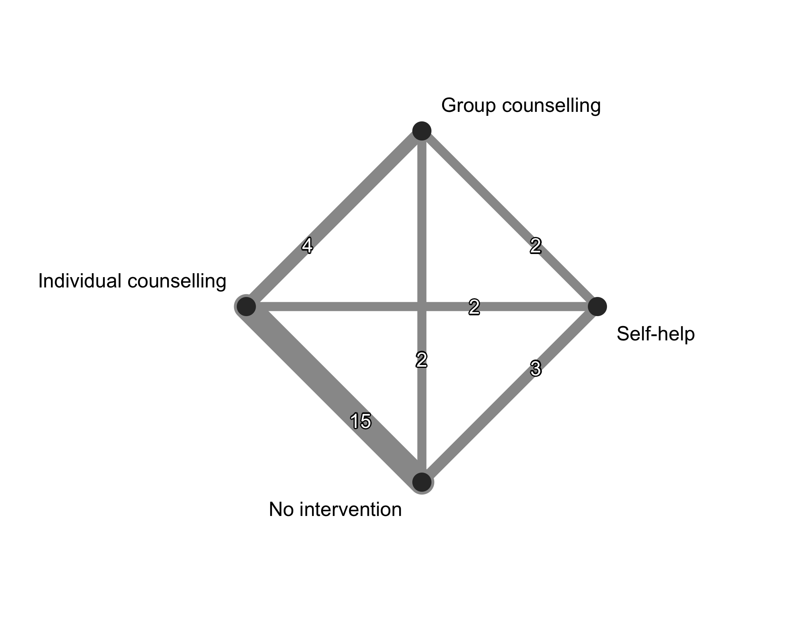
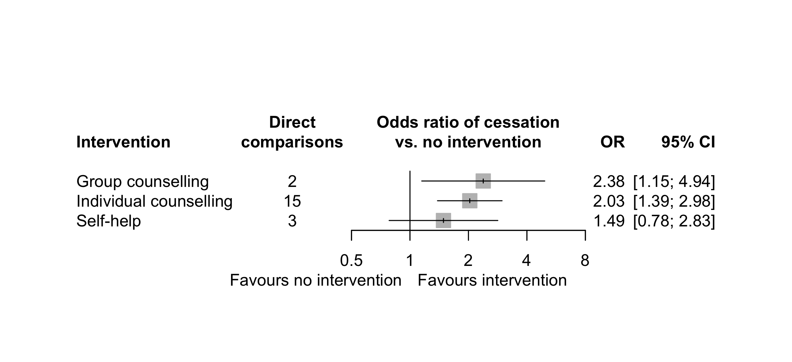
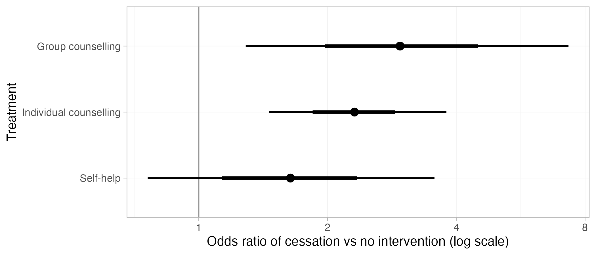
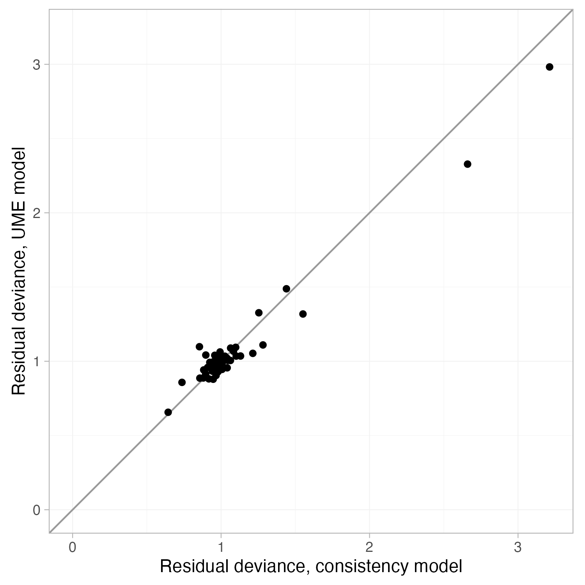

# Network meta-analysis of smoking cessation interventions

A short, fully reproducible network meta-analysis (NMA) in R, run in two ways on the same published dataset: frequentist with `netmeta` and Bayesian with `multinma` (Stan).

## Question

Among people who smoke, how do self-help, individual counselling, and group counselling compare with no intervention, and with each other, for successful cessation at six to twelve months?

## Data

Hasselblad V. Meta-analysis of multitreatment studies. *Med Decis Making* 1998;18(1):37-43. https://doi.org/10.1177/0272989X9801800110

Data is pulled from 24 randomized trials of four interventions in 16,740 participants, including two three-arm trials. The dataset ships with both packages (`netmeta::smokingcessation`, `multinma::smoking`), so there is no need to download anything.

## Methods

| Step | Frequentist (`R/nmaFrequentist.R`) | Bayesian (`R/nmaBayesian.R`) |
|---|---|---|
| Model | Random-effects NMA on log odds ratios, REML estimate of tau², multi-arm correlation handled | Binomial likelihood, logit link, random effects, vague N(0, 100²) priors on baselines and treatment effects, half-normal(5) on tau |
| Ranking | P-scores | Posterior rank probabilities and SUCRA |
| Model fit | Q decomposition (within and between designs) | DIC and residual deviance, fixed vs random effects |
| Inconsistency | Design-by-treatment interaction test, node-splitting (SIDE) | Unrelated mean effects (UME) model, dev-dev plot |
| Small-study effects | Comparison-adjusted funnel plot, Egger test | Not assessed |

## Results (frequentist)

Odds ratio of cessation versus no intervention, random effects:

| Intervention | OR (95% CI) | P-score |
|---|---|---|
| Group counselling | 2.38 (1.15 to 4.94) | 0.85 |
| Individual counselling | 2.03 (1.39 to 2.98) | 0.72 |
| Self-help | 1.49 (0.78 to 2.83) | 0.40 |
| No intervention | Reference | 0.04 |

As shown, both counselling formats roughly doubled the odds of quitting, but the data cannot separate group from individual counselling (OR 1.17, 95% CI 0.59 to 2.34), and the self-help estimate is compatible with no effect.

Heterogeneity is substantial (tau² = 0.45, I² = 89%), driven (almost) entirely by the 14 two-arm trials of individual counselling vs no intervention. The common-effects Q decomposition flags inconsistency between designs (Q = 15.22, df = 7, p = 0.033), but this test is inflated by said heterogeneity. Under a random-effects design-by-treatment interaction model the signal disappears (Q = 4.66, df = 7, p = 0.70), and node-splitting finds no comparison where direct and indirect evidence clearly disagree (all p > 0.25).




## Results (Bayesian)

Posterior median odds ratio of cessation vs no intervention, random effects:

| Intervention | OR (95% CrI) | SUCRA |
|---|---|---|
| Group counselling | 2.95 (1.29 to 7.32) | 0.87 |
| Individual counselling | 2.31 (1.46 to 3.79) | 0.70 |
| Self-help | 1.64 (0.76 to 3.56) | 0.40 |

Between-study SD (tau): 0.82 (95% CrI 0.54 to 1.28).



| Model | Residual deviance | pD | DIC |
|---|---|---|---|
| Fixed effects | 267.3 | 27.2 | 294.5 |
| Random effects | 54.2 | 44.0 | 98.1 |
| Random effects, UME (inconsistency) | 53.7 | 45.3 | 99.0 |

The random-effects model fits well (residual deviance 54.2 against 50 data points) and the fixed-effects model does not. Important to note, relaxing the consistency assumption does not improve fit (DIC 99.0 vs 98.1), which agrees with the frequentist random-effects checks.



## Frequentist vs Bayesian

The two approaches agree on the direction of every effect, the ordering of the interventions, and which effects can be distinguished from no intervention. The Bayesian estimates are somewhat larger with wider intervals, which is likely due to the Bayesian model's heterogeneity and its use of exact binomial likelihood. The Bayesian model estimates more heterogeneity (tau 0.82 vs 0.67 from REML) and also carries the uncertainty in tau through to the intervals. It also uses the exact binomial likelihood, where `netmeta` works from log odds ratios under a normal approximation (two arms have zero events).

The full comparison is in `output/results_comparison.csv`.

## Reproduce

```r
install.packages(c("netmeta", "multinma", "ggplot2"))
```

```bash
Rscript R/nmaFrequentist.R
Rscript R/nmaBayesian.R
```

## Limitations

This is a methods demonstration on a teaching dataset and not a current evidence synthesis. The trials are quite old, with intervention definitions varying across studies. Importantly, no covariates are available to explore the heterogeneity. Group counselling and self-help each rest on a handful of direct comparisons.
